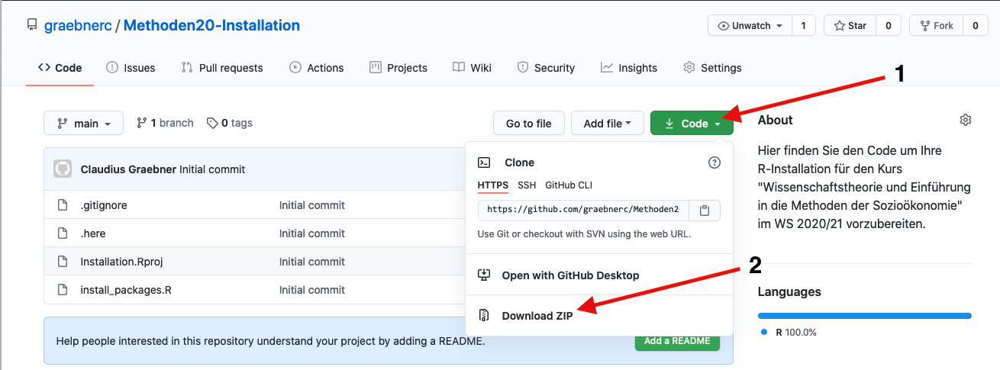

# Skript zur Installation der notwendigen R-Pakete

Laden Sie sich den Code als ZIP-Archiv herunter indem Sie auf `Code` und dann
`Download ZIP` klicken:

Folgen Sie dann den Anweisungen in den Installationshinweisen aus dem
Moodle Kurs.